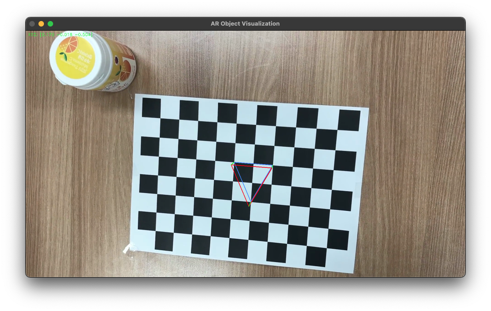
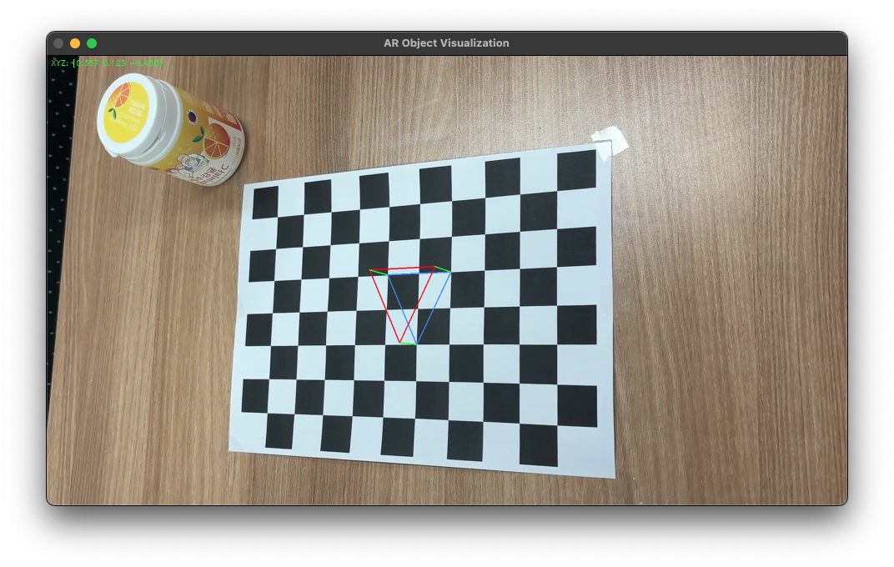
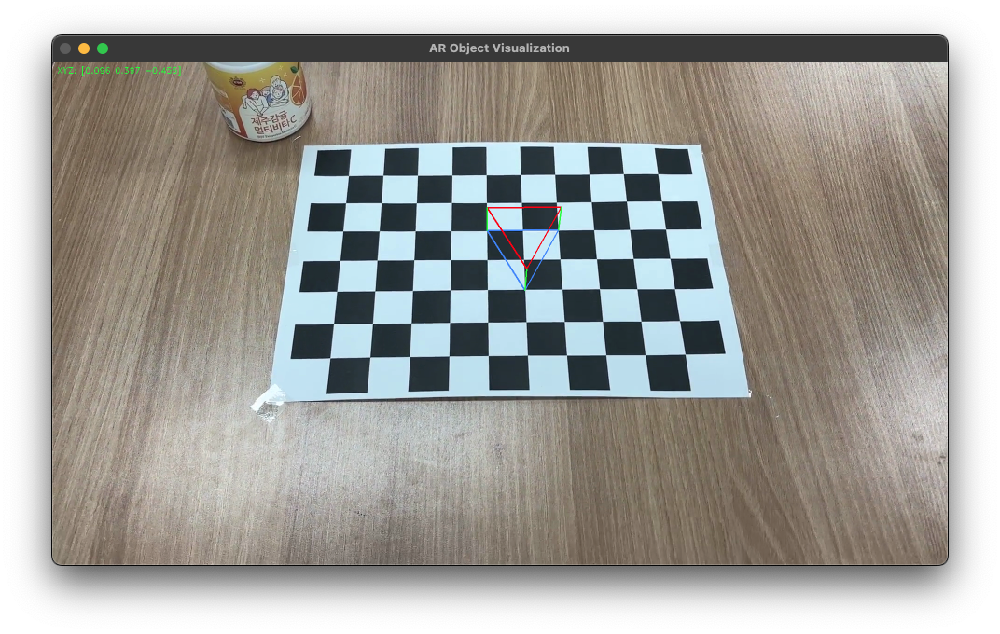

# AR Object Visualizationer
### A program that draws AR object on a chessboard
---
## 카메라 캘리브레이션 결과 (chessboard-distortion-correction 참고)
* The number of selected images = 42
* RMS error = 0.567463
* Camera matrix (K) = [
    [1735.925 0.000 993.063]
    [0.000 1735.934 573.203]
    [0.000 0.000 1.000]
]
* Distortion coefficient (k1, k2, p1, p2, k3) = 0.251413, -1.188235, 0.009189, 0.011738, 1.854149

## AR Object visualization (Triangle)
  
  
